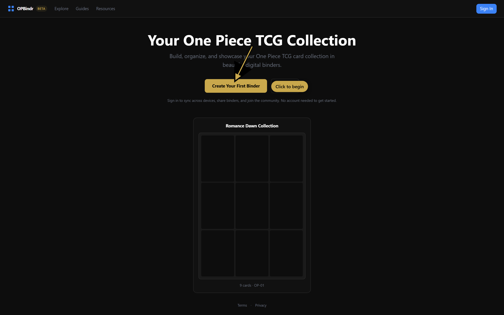

# screenshot-annotator

[](https://www.npmjs.com/package/screenshot-annotator)
[](LICENSE)

Capture annotated screenshots of any web UI for documentation, tutorials, and product walkthroughs. Annotations (highlight boxes, numbered callouts, text labels, arrows) are injected into the page as real DOM elements before Playwright captures the screenshot, so they render at full resolution, scale with the page, and match your design system.



## Why

Documentation screenshots usually mean:

- Take a screenshot manually
- Open Figma/Photoshop
- Add arrows and labels by hand
- Re-export
- Repeat every time the UI changes

This tool turns all of that into a single `node` command. Annotations are defined in code, anchored to selectors, and re-rendered automatically when the UI changes.

## Install

### npm (recommended)

```bash
npm install --save-dev screenshot-annotator playwright
npx playwright install chromium
```

### Claude skill

```bash
npx skills add arjunkai/screenshot-annotator
```

Then in any conversation: "Take an annotated screenshot of localhost:5173 highlighting the login button". Claude will use the skill.

## 30-second example

```js
import { chromium } from 'playwright';
import { annotate } from 'screenshot-annotator';

const browser = await chromium.launch();
const page = await browser.newPage();
await page.goto('https://opbindr.com');

await annotate(page, [
  {
    type: 'arrow',
    fromTarget: page.getByRole('heading', { name: /collection/i }),
    toTarget: page.getByRole('button', { name: /create your first binder/i }),
  },
  {
    type: 'label',
    target: page.getByRole('button', { name: /create your first binder/i }),
    text: 'Click to begin',
    position: 'right',
  },
]);

await page.screenshot({ path: 'home.png' });
await browser.close();
```

That's it. The arrow and label render at the correct positions on the live page.

Default color is red (`#ef4444`), the docs convention for "look here." Pass `color:` on any annotation to match your brand:

```js
{ type: 'arrow', fromTarget: ..., toTarget: ..., color: '#3b82f6' }  // blue
{ type: 'label', target: ..., text: 'New', color: '#10b981' }          // green
```

## The killer feature: spec replay

Screenshots in docs go stale because the UI changes faster than people remember to retake them. This tool fixes that by saving the *intent* of each screenshot as a JSON sidecar:

```json
{
  "url": "https://opbindr.com",
  "viewports": [
    { "name": "desktop", "width": 1440, "height": 900 },
    { "name": "mobile",  "width": 390,  "height": 844 }
  ],
  "setup": [
    { "action": "waitForSelector", "selector": "h1" }
  ],
  "annotations": [
    {
      "type": "label",
      "selector": "role=button[name=/create your first binder/i]",
      "text": "Click to begin",
      "position": "right",
      "color": "#ef4444"
    }
  ]
}
```

When the UI changes, re-render every screenshot in your docs with **one command**:

```bash
npx screenshot-annotator replay public/guide
```

For each `*.spec.json` it finds, you get a fresh `.png` next to it (one per viewport: `feature.desktop.png`, `feature.mobile.png`).

Want to point at staging or a feature branch instead of prod? Override the origin with `SCREENSHOT_URL`:

```bash
SCREENSHOT_URL=https://staging.myapp.com npx screenshot-annotator replay public/guide
```

## Annotation primitives

| Type | What it does | Use when |
|---|---|---|
| `highlight` | Colored rectangle with darkened backdrop around a target | "This is the thing I'm talking about" |
| `callout` | Numbered circle at a corner of a target (1, 2, 3…) | Step-by-step sequences referenced from text |
| `label` | Text pill anchored to a target with `position: 'right' \| 'left' \| 'above' \| 'below'` | Inline explanations |
| `arrow` | SVG arrow between two locators or coordinates | Connecting two elements visually |

Each annotation accepts either Playwright Locators (`page.getByRole(...)`, `page.getByText(...)`) when used in a script, or selector strings (`role=button[name="Save"]`, `text="Filters"`) when used in a spec.

## Capturing interactive states

Hover effects, dropdowns, focus rings, and tooltips only appear when the user interacts with the page. Specs support setup actions to trigger them:

```json
{
  "setup": [
    { "action": "hover",   "selector": ".user-avatar" },
    { "action": "focus",   "selector": "input[name='search']" },
    { "action": "type",    "selector": "input[name='search']", "text": "luffy" },
    { "action": "press",   "key": "Enter" },
    { "action": "scroll",  "selector": ".footer" }
  ]
}
```

Full list: `click`, `hover`, `focus`, `fill`, `type`, `press`, `scroll`, `waitForSelector`, `waitForTimeout`.

## Quick start without writing any code

```bash
npx screenshot-annotator example     # writes a starter example.spec.json
npx screenshot-annotator replay .    # produces example.png + example.mobile.png
```

## CLI reference

```
npx screenshot-annotator replay <dir>     # re-render every spec in <dir>
npx screenshot-annotator example          # write a starter spec in cwd
npx screenshot-annotator --help
```

Env vars:

- `SCREENSHOT_URL`: override the origin of every spec (point at staging/dev)

## Programmatic API

```js
import {
  annotate, clearAnnotations,
  saveSpec, loadSpec, replaySpec,
  hoverByMouse, waitForImagesLoaded, raceVisible,
} from 'screenshot-annotator';
```

See [`examples/example-script.js`](examples/example-script.js) for a complete worked example that captures + saves spec + supports multi-viewport.

### Setup helpers

These fix four gotchas that keep tripping real screenshot scripts. See [SKILL.md](SKILL.md#common-pitfalls-and-helpers-that-fix-them) for the full explanation.

- **`hoverByMouse(page, locator)`**: hover via raw mouse movement, skipping Playwright's actionability stall on re-rendering elements
- **`waitForImagesLoaded(page, opts?)`**: wait until ≥90% of *visible* images have decoded (use before screenshotting virtualized grids)
- **`raceVisible(page, locatorMap, opts?)`**: race multiple locators, return the key of whichever becomes visible first (for branching landing-page states)

Also: **don't use `waitUntil: 'networkidle'` with a dev server.** HMR keeps WebSockets open so it never triggers. Use `'domcontentloaded'` and wait for specific selectors.

## Requirements

- Node 18+
- Playwright (`npm install -D playwright && npx playwright install chromium`)
- A web UI to screenshot (local dev server or production URL)

## License

MIT
