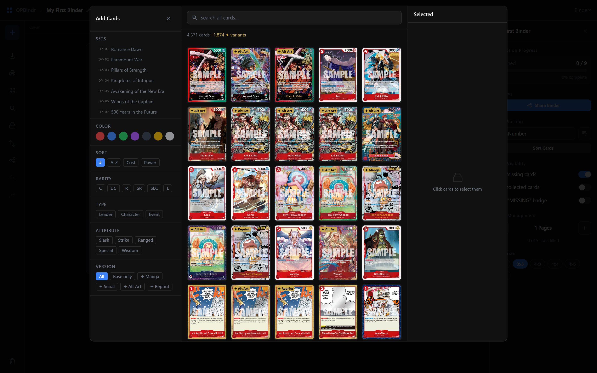
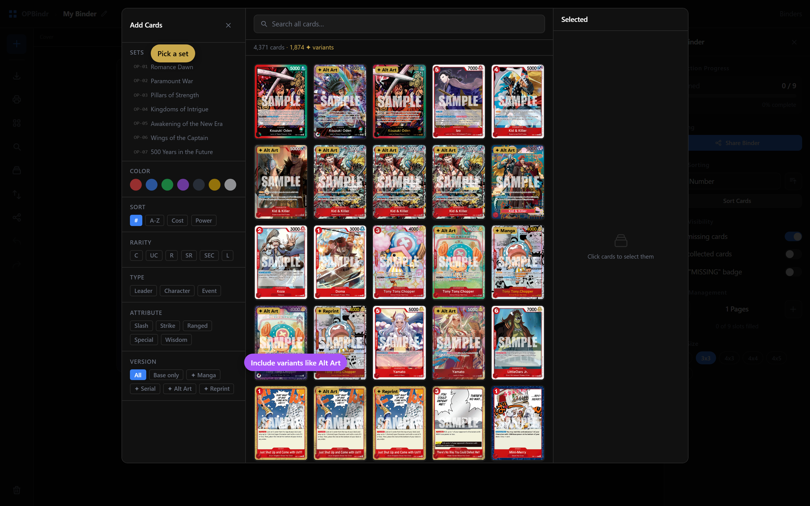

# screenshot-annotator

A Claude skill for capturing annotated screenshots of any web UI.

Annotations (highlight boxes, numbered callouts, text labels) are injected into the page as real DOM elements before the screenshot is taken — so they render at full resolution, scale with the page, and match your design system.

## Why

Documentation screenshots usually mean:

- Take a screenshot manually
- Open Figma/Photoshop
- Add arrows and labels by hand
- Re-export
- Repeat every time the UI changes

This skill turns that into a single `node` command. Annotations are defined in code, anchored to selectors, and re-rendered automatically when the UI changes.

## Examples

**Plain screenshot:**



**With labels and callouts:**



## Install

### As an npm package (recommended)

```bash
npm install --save-dev screenshot-annotator playwright
npx playwright install chromium
```

Then re-render every screenshot in a directory with one command:

```bash
npx screenshot-annotator replay public/guide
```

Or import the API in your own scripts:

```js
import { annotate, saveSpec, replaySpec } from 'screenshot-annotator';
```

### As a Claude skill

```bash
npx skills add arjunkai/screenshot-annotator
```

Then in any conversation: "Take an annotated screenshot of localhost:5173 highlighting the login button" — Claude will use the skill.

## Quick start

```bash
npx screenshot-annotator example         # writes example.spec.json in cwd
npx screenshot-annotator replay .        # produces example.png from the spec
```

## Annotation primitives

- **highlight** — colored rectangle with darkened backdrop around a target
- **callout** — numbered circle at a corner of a target (for sequential steps)
- **label** — text pill anchored to the side of a target

Each annotation takes a Playwright Locator (`page.getByRole(...)`, `page.getByText(...)`, etc.) as its target. The skill resolves the locator to a bounding box, then renders the annotation at that position.

## Requirements

- Node 18+
- Playwright (`npm install -D playwright && npx playwright install chromium`)
- A web UI to screenshot (local dev server or production URL)

## License

MIT
